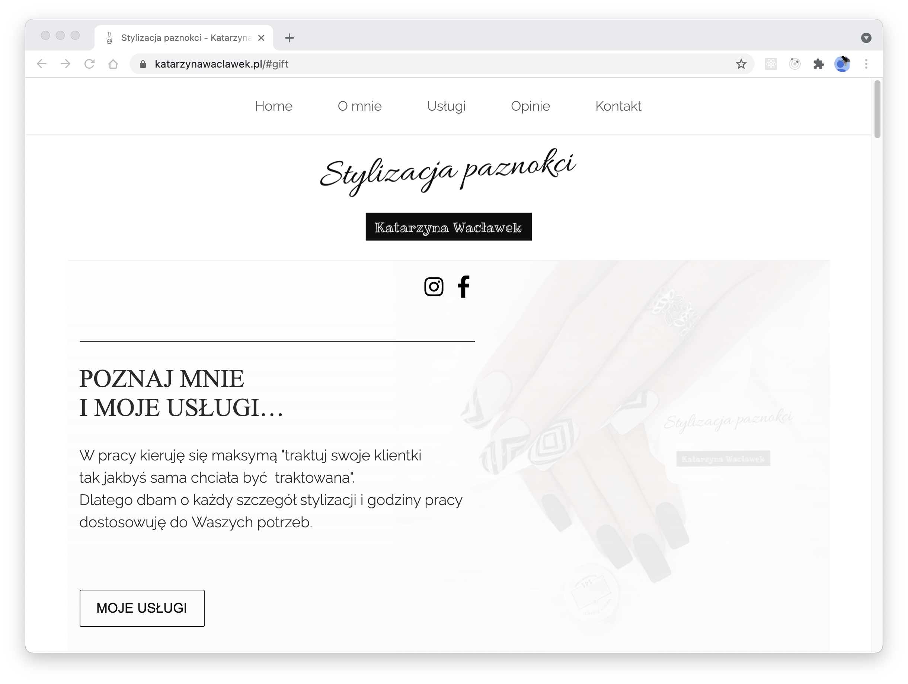
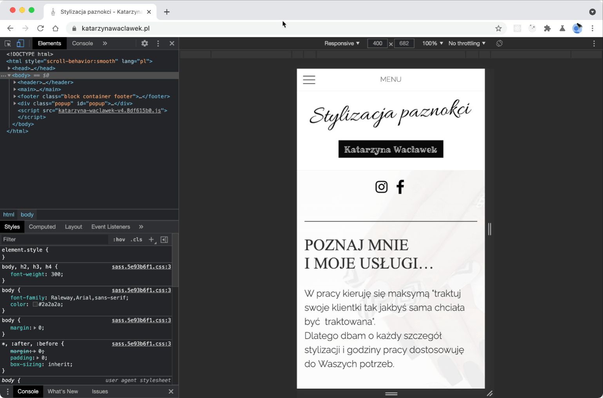
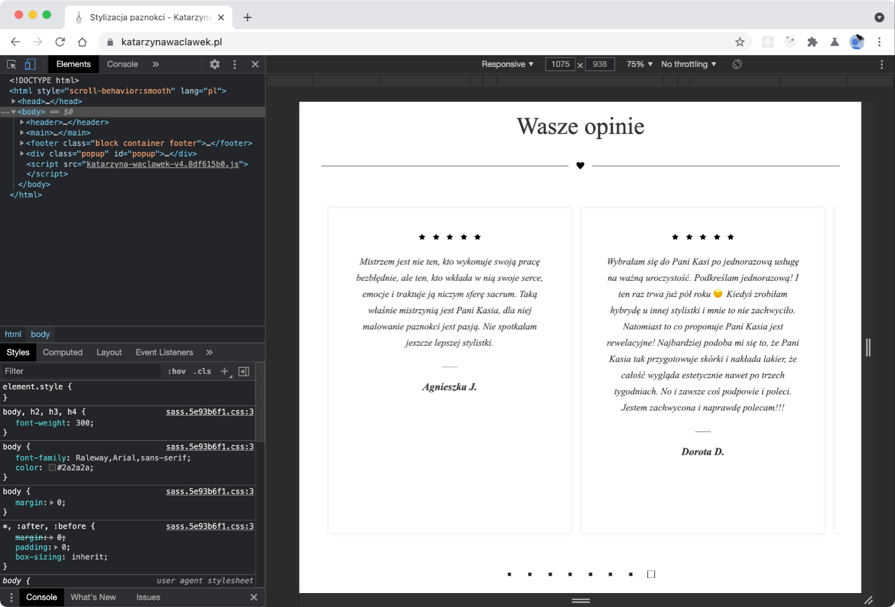
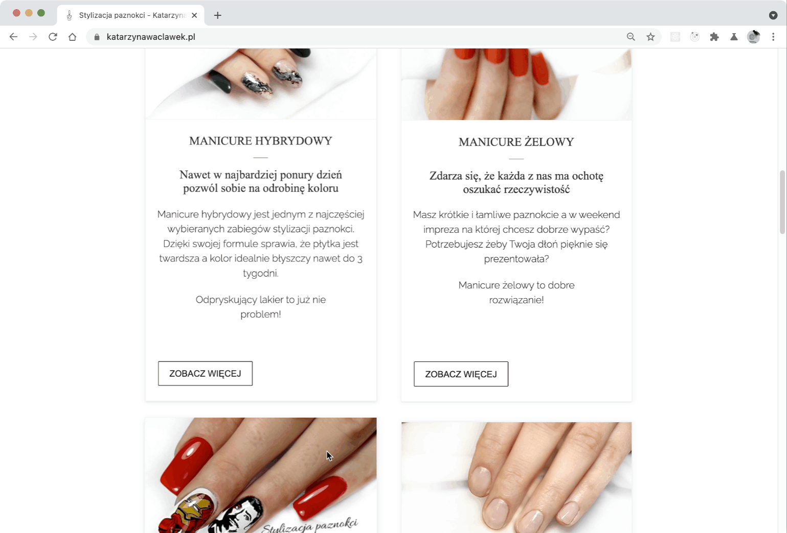
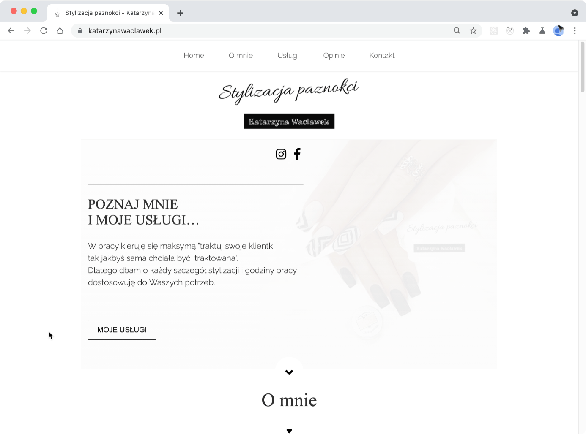
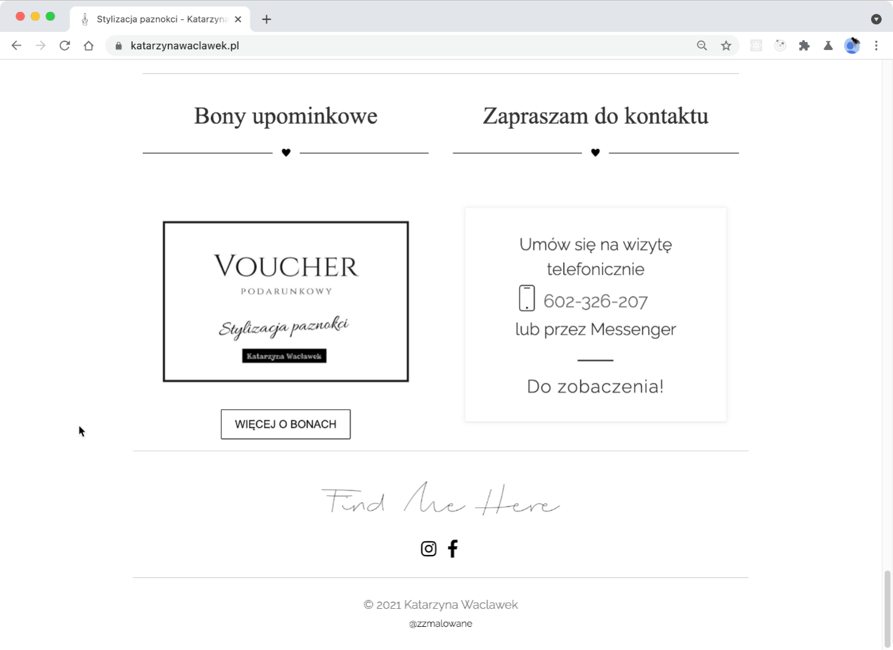
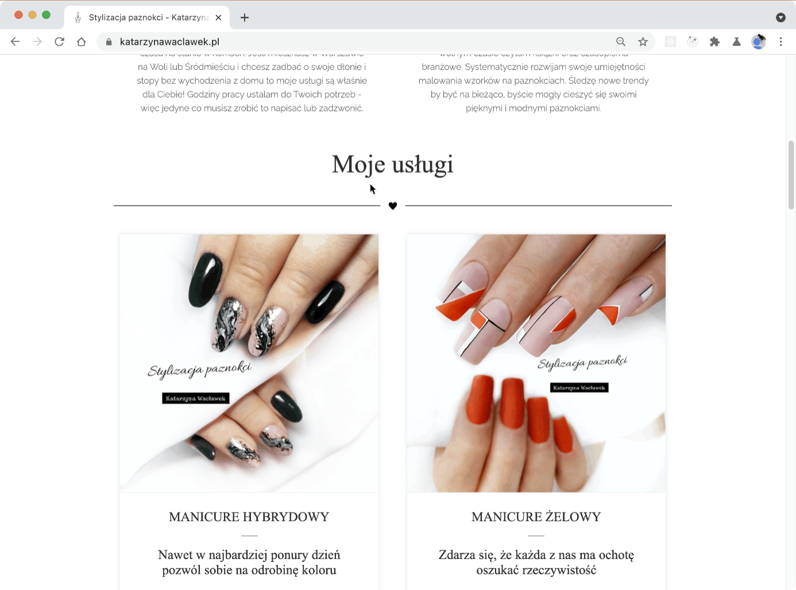
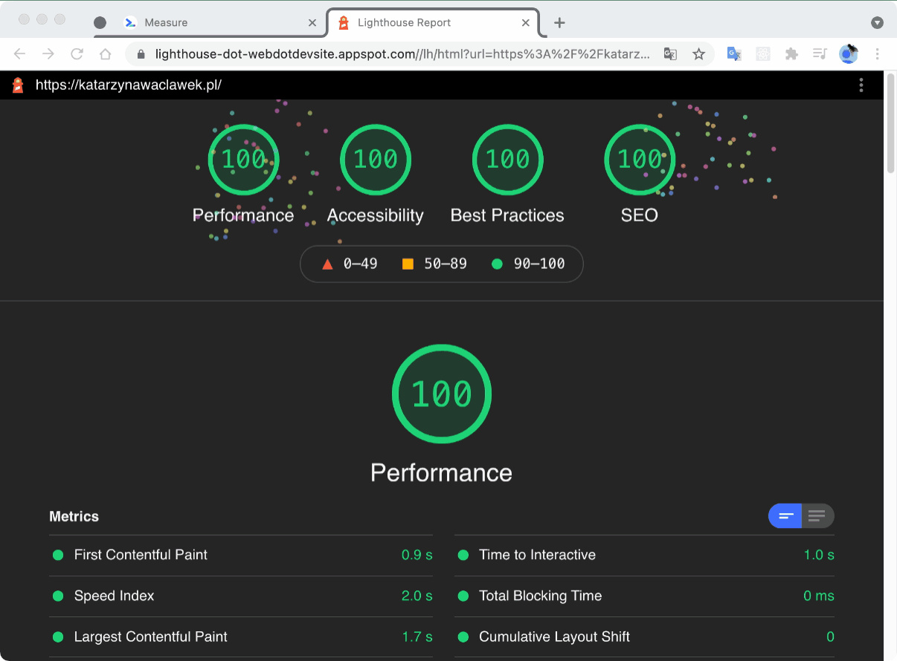

# [katarzynawaclawek.pl](https://katarzynawaclawek.pl/)

## 1. About project
There's a site which I've created for my girlfriend. During building the page I've solved a few issues and learned many new things.

## 2. Stack
To build the project I've used many things I've learned in my frontend development path.  

#### I've used:  
🚀 Parcel (I've added a little of configuration).    
🚀 SASS (nesting, variables, imports, mixins).   
🚀 BEM.    
🚀 7-1 CSS.  
🚀 OOCSS.  
🚀 CSS (Flexbox, CSS Grid, Animations, Mediaqueries).  
🚀 Glide.js.  
🚀 Adobe Illustrator (I've created SVG images).   
🚀 Java Script (ES6)

## 3. About components
I've built some nice components.
### 3.1 Mobile menu
I was inspired by the menu I had found in one page on the internet. I've debugged that menu, copied some elements and added others.    

### 3.2 Carousel
I've used Glide.js. I've customized settings and overridden styles to achieve effects which I wanted. I've installed a few instances with different options.

### 3.3 Card
Cards have the same height and buttons are on the bottom. During focusing on the card it grows up and changes shadow. Also image in the card is transformed.   

### 3.4 Button
I've customized the button which I had found in a collection of buttons on [Codepen](https://codepen.io/markmead/pen/mjpGvj).  

### 3.5 Popup
I've customized the popup which I'd learned in the course  ["Advanced CSS and Sass"](https://www.udemy.com/course/advanced-css-and-sass/).  

### 3.6 Heart animation
I've built an animated heart component to separate sections on the page.

## 4. Optimalizations
Before publishing the page on the internet, I'd been focusing on page optimalization.   

I did a test on [web.dev](https://web.dev/) and after that I did some improvements. Finally I've achieved 4 x 100/100.  

To optimize the site I've used stuff like: padding hack, font-face property, picture attribute, webP format, etc.

### 4.1 Padding hack
I used this to prevent the page content from moving. I've learnt it from [Alex Carpenter](https://www.youtube.com/watch?v=iSaBRUgAXnk&list=PL_Isa-qWGFalHTEdh06r4uQVnSPIlf55s&index=8). 

### 4.2 I've used font-face instead @import fonts from google
I've learnt it from this [article](https://www.machmetrics.com/speed-blog/google-fonts-slow-your-site-make-google-fonts-faster/).

### 4.3 I've used picture atribute and modern webfonts
I've learnt It from the course [The Ultimate HTML/CSS Mastery Series](https://codewithmosh.com/p/the-ultimate-html-css).   

I've used this site to crop images [onlineconvertfree.com](https://onlineconvertfree.com/pl/crop-image/).   

I've used this site to resize images [www.iloveimg.com](https://www.iloveimg.com/resize-image).   

I've used this site to convert images to webP [cloudconvert.com/](https://cloudconvert.com/).   

### 4.4 lazy loading
Images are loaded only when it is necessary.  

## 5. Development
This is my first website I've published on the Internet. I'm glad from this site, but I have some ideas to do.  

In the future I'm going to work on some stuff like:
- FAQ subpage
- Person Introduction
- Articles subpage
- Focusing on SEO
